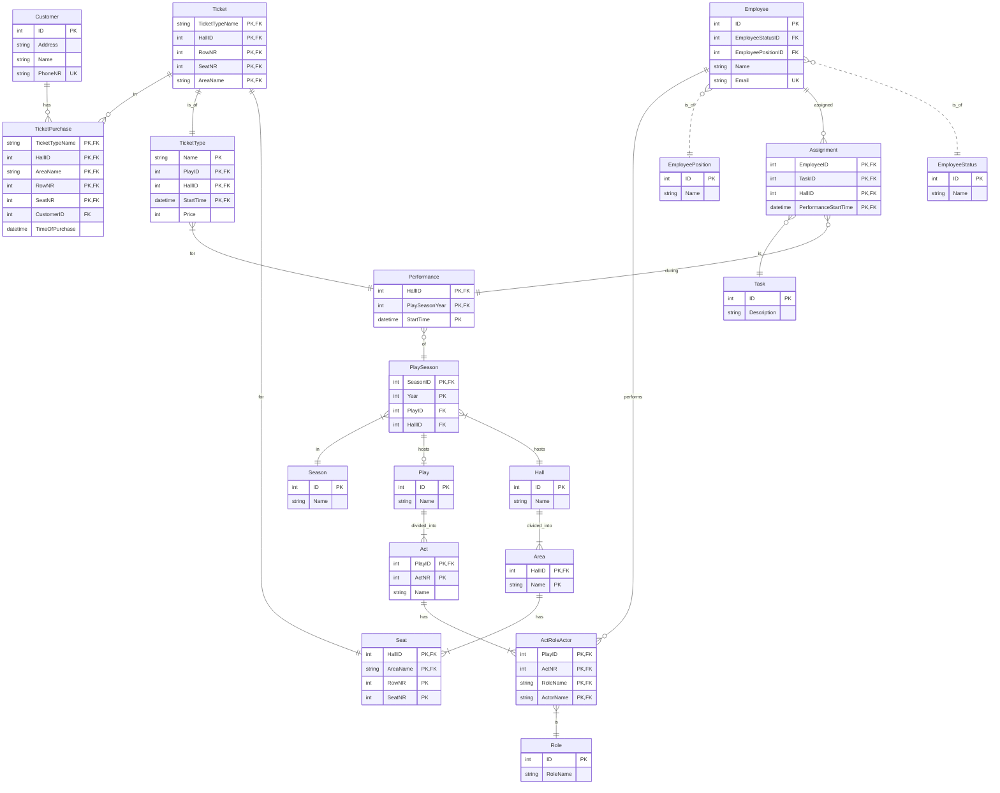

# DatDat DB2

## How to use

Kjør `python3 main.py` i terminalen så opprettes tabeller og seed data i db2.db

NB! Foreign key constraint er skrudd på som standard

## Diagram of schema

```mermaid
erDiagram

%% Play section
Season {
    int ID PK
    string Name
}
PlaySeason }|--|| Season : in
PlaySeason {
    int SeasonID PK,FK
    int Year PK
    int PlayID FK
    int HallID FK
}
PlaySeason ||--o| Play : hosts
PlaySeason }|--|| Hall : hosts
Play {
    int ID PK
    string Name
}
Play ||--|{ Act : divided_into

Act {
    int PlayID PK,FK
    int ActNR PK
    string Name
}
Role {
    int ID PK
    string RoleName
}

ActRoleActor {
%% Act FK START:
    int PlayID PK,FK
    int ActNR PK,FK
%% Act FK END;
    string RoleName PK,FK
    string ActorName PK,FK
}
Act ||--|{ ActRoleActor : has
ActRoleActor }|--|| Role : is
Employee ||--o{ ActRoleActor : performs

%% Performance section
Performance {
    int HallID PK,FK
    int PlaySeasonYear PK,FK
    datetime StartTime PK
}
Performance }o--|| PlaySeason : of

Hall {
    int ID PK
    string Name 
}
Hall ||--|{ Area : divided_into
Area {
    int HallID PK,FK
    string Name PK
}
Area ||--|{ Seat : has

Seat {
%% Area FK START:
    int HallID PK,FK
    string AreaName PK,FK
%% Area FK END;
    int RowNR PK
    int SeatNR PK
}

%% Ticket section
Customer {
    int ID PK
    string Address
    string Name
    string PhoneNR UK
}
Customer ||--o{ TicketPurchase : has

TicketPurchase {
%% Ticket FK START:
    string TicketTypeName PK,FK
    int HallID PK,FK
    string AreaName PK,FK
    int RowNR PK,FK
    int SeatNR PK,FK
%% Ticket FK END;
    int CustomerID FK
    datetime TimeOfPurchase
}
Ticket ||--o{ TicketPurchase : in

TicketType {
    string Name PK
%% Play FK START:
    int PlayID PK,FK
    int HallID PK,FK
%% Play FK END;
    datetime StartTime PK,FK
    int Price
}
TicketType }|--|| Performance : for
Ticket {
%% TicketType FK START:
    string TicketTypeName PK,FK
    int HallID PK,FK
%% TicketType FK END;
%% Seat FK START:
    int RowNR PK,FK
    int SeatNR PK,FK
    string AreaName PK,FK
%% Seat FK END;
}
Ticket ||--|| TicketType : is_of
Ticket ||--|| Seat : for

%% Task section
EmployeeStatus {
    int ID PK
    string Name
}
EmployeePosition {
    int ID PK
    string Name
}
Employee {
    int ID PK
    int EmployeeStatusID FK
    int EmployeePositionID FK
    string Name
    string Email UK
}
Employee }o..|| EmployeePosition : is_of
Employee ||--o{ Assignment : assigned
Employee }o..|| EmployeeStatus : is_of

Assignment {
%% Employee FK START:
    int EmployeeID PK,FK
%% Employee FK END;
%% Task FK START:
    int TaskID PK,FK
%% Task FK END;
%% Performance FK START:
    int HallID PK,FK
    datetime PerformanceStartTime PK, FK
%% Performance FK END;
}
Assignment }o--|| Task : is
Assignment }o--|| Performance : during

Task {
    int ID PK
    string Description
}
```