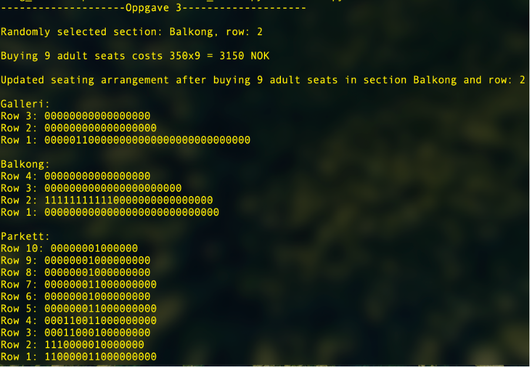
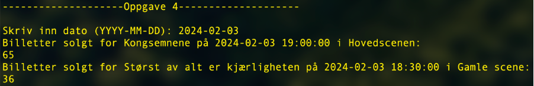
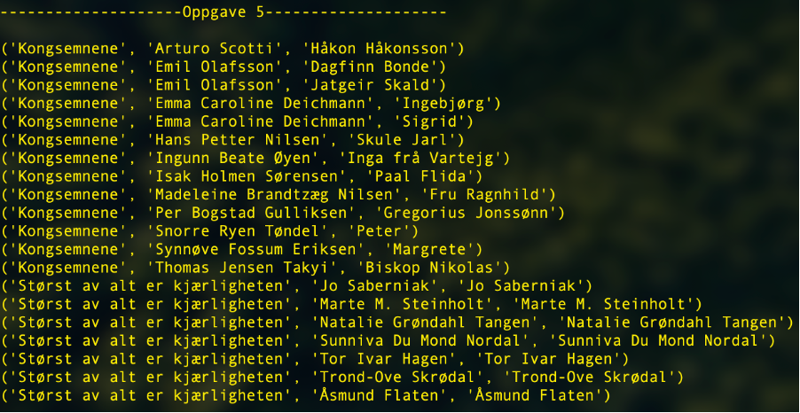
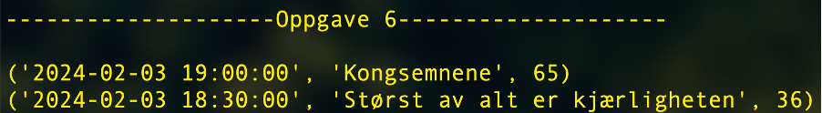
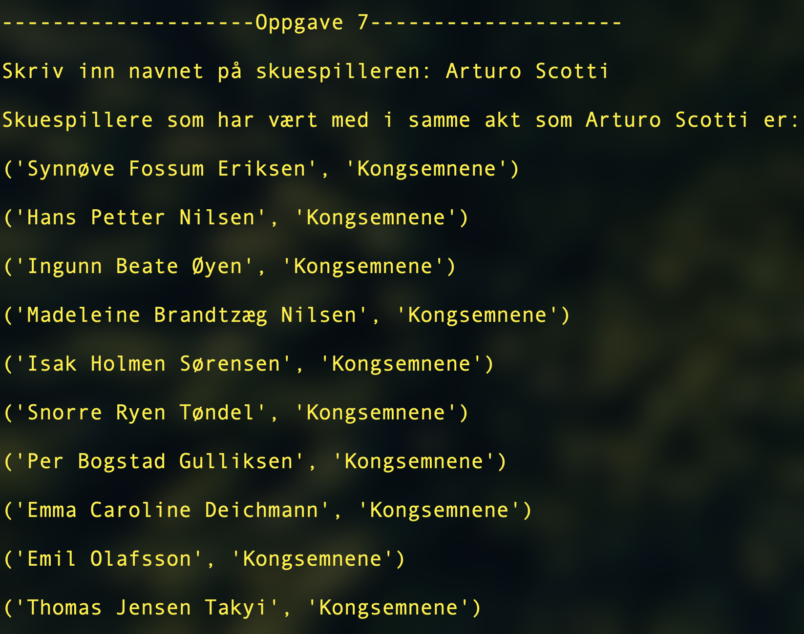
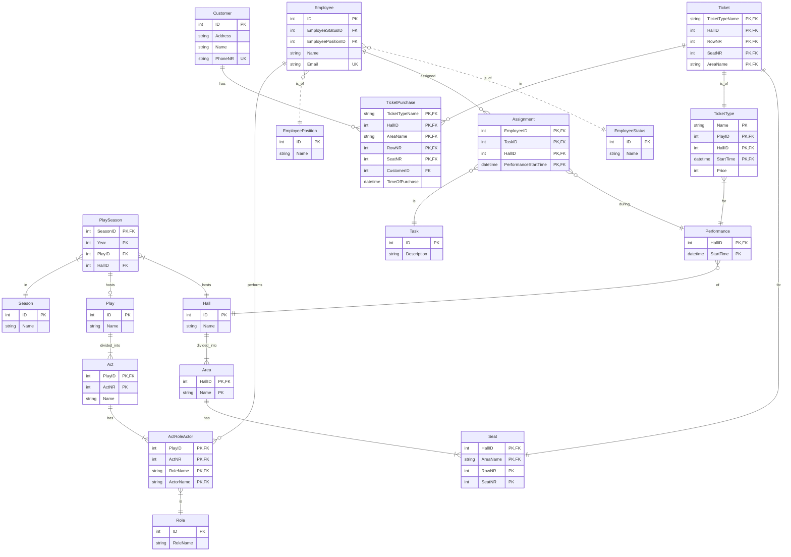

# DatDat DB2 - Gruppe 122
Oppgave 1, 2, 3, 4, 5, 6 og 7 blir kjørt automatisk via main.py

## Oppskrift

Utfør følgende steg beskrevet under i terminalen inni mappen «datdat_db2»
#### Kjør `python3 main.py` i terminalen
    
1. Dette oppretter tabeller og seed data i db2.db 
    
2. Deretter kjøres Oppgave2_insertAndBuySeatsHovedScenen.py

    Dette setter inn stoler for Hovedscenen i db2.db samt kjøper billetter for forestilling 2024-02-03 Kongsemne

3. Deretter kjøres Oppgave2_insertAndBuySeatsGamleScene.py

    Dette setter inn stoler for Gamle Scene i db2.db samt kjøper billetter for forestillingen 2024-02-03 Størst av alt er kjærligheten

4.  Deretter kjøres oppgave3.py

    Programmet printer ut resultatet i terminalen
    
5. Deretter kjøres oppgave4.py

    > Programmet ber om dato i format (YYYY-MM-DD)
    
    Programmet printer ut resultatet i terminalen

6. Deretter kjøres oppgave5.sql

    Resultatet printes ut i terminalen
    
7. Deretter kjøres oppgave6.sql

    Resultatet printes ut i terminalen
    
8. Deretter kjøres oppgave7.py

    > Programmet ber om navn til skuespilleren. NB: input er case sensetiv. 
    
    Resultatet printes ut i terminalen.

## Forventede resultat

Oppgave 3:
Programmet velger random seksjon og rad i Gamlescene og kjøper 9 voksenbilletter i valgt seksjon og rad.

Oppgave 4:
(NB: Det finnes bare en forestillingsdato (2024-02-03) der det er solgte billetter.)

Oppgave 5:

Oppgave 6:

Oppgave 7:

## Diagram av skjema

